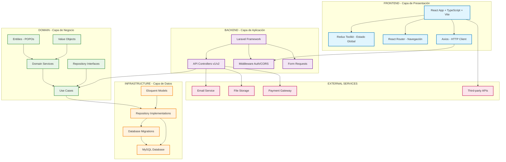
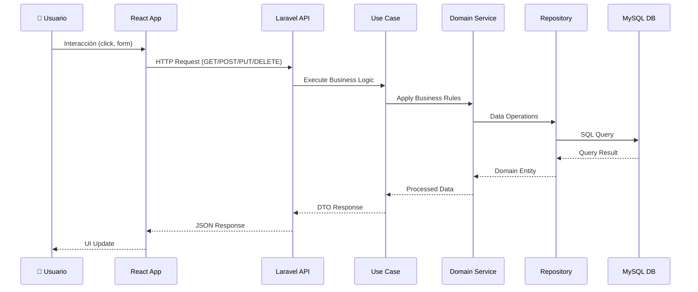
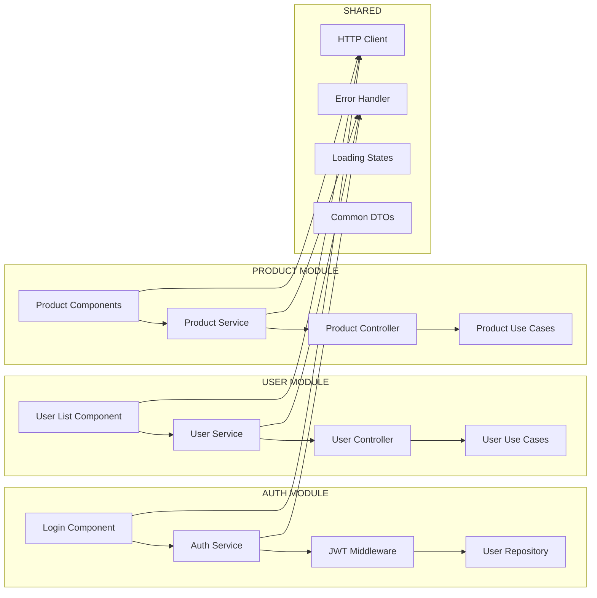
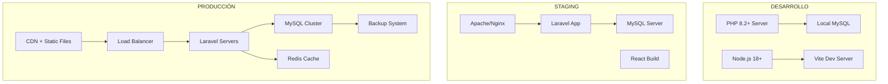

# Diagrama de Arquitectura General

## ¿Qué es?

El diagrama de arquitectura general es una representación visual de alto nivel
que muestra cómo interactúan todos los componentes del sistema. Proporciona una
vista completa de la arquitectura, incluyendo las capas del sistema, los flujos
de datos, las tecnologías utilizadas y las interfaces entre componentes.

Esta representación gráfica sirve como la "hoja de ruta visual" del proyecto,
permitiendo a desarrolladores, stakeholders y nuevos miembros del equipo
comprender rápidamente la estructura y funcionamiento del sistema.

## ¿Por qué es importante?

- **Visión de conjunto**: Proporciona una vista completa del sistema en una sola imagen
- **Comunicación efectiva**: Facilita la explicación de la arquitectura a diferentes audiencias
- **Toma de decisiones**: Ayuda a identificar puntos críticos y áreas de mejora
- **Documentación viva**: Sirve como referencia durante todo el ciclo de vida del proyecto
- **Onboarding**: Acelera la comprensión del sistema para nuevos desarrolladores
- **Identificación de dependencias**: Muestra claramente las relaciones entre componentes

## ¿Qué debe incluir?

### 1. Diagrama de Arquitectura Completa

- **Capas del sistema** claramente diferenciadas
- **Tecnologías utilizadas** en cada capa
- **Flujos de datos** y comunicación entre componentes
- **Bases de datos** y sistemas de persistencia
- **APIs** y puntos de integración
- **Servicios externos** y dependencias

### 2. Componentes por Capa

- **Frontend**: React, TypeScript, Vite, Redux Toolkit
- **Backend**: Laravel, Clean Architecture, APIs RESTful
- **Base de datos**: MySQL, migraciones, relaciones
- **Infraestructura**: Servidores, caché, balanceadores

### 3. Flujos de Información

- **Autenticación** y autorización
- **Procesamiento de datos** de negocio
- **Comunicación** entre microservicios
- **Manejo de errores** y logging

## ¿Qué debo hacer?

### 1. Crear el Diagrama Principal



### 2. Diagrama de Flujo de Datos



### 3. Diagrama de Arquitectura por Módulos



### 4. Diagrama de Infraestructura



### 5. Documentar las Decisiones

- **Por qué Clean Architecture**: Separación de responsabilidades
- **Por qué MySQL**: Relaciones complejas y ACID compliance
- **Por qué React + TypeScript**: Tipado fuerte y componentes reutilizables
- **Por qué Redux Toolkit**: Estado global predecible
- **Por qué Laravel**: Ecosistema robusto y ORM potente

## Tips

### 🎨 **Herramientas de Diagramación**

- **Mermaid**: Integrado con Markdown, ideal para documentación
- **Draw.io**: Gratuito, potente, integrable con GitHub
- **Lucidchart**: Profesional, colaborativo
- **Figma**: Para diagramas más visuales y presentaciones

### 📊 **Buenas Prácticas**

- **Mantén simplicidad**: No sobrecargues el diagrama con detalles
- **Usa colores consistentes**: Cada capa con su color identificativo
- **Incluye leyenda**: Explica símbolos y convenciones
- **Actualiza regularmente**: El diagrama debe reflejar la realidad
- **Múltiples vistas**: Crea diagramas específicos para diferentes audiencias

### 🔄 **Versionado**

- Versiona los diagramas junto con el código
- Documenta cambios significativos en la arquitectura
- Mantén un historial de evolución del sistema

### 👥 **Audiencias Diferentes**

- **Técnica**: Incluye detalles de implementación
- **Ejecutiva**: Enfócate en componentes de alto nivel
- **Stakeholders**: Muestra flujos de usuario y valor de negocio

## Ejemplos

### Arquitectura Simplificada para Stakeholders

```
┌─────────────────────────────────────────────────────────┐
│                  SISTEMA COMPLETO                      │
├─────────────────────────────────────────────────────────┤
│                                                         │
│  ┌─────────────┐    ┌─────────────┐    ┌─────────────┐ │
│  │   FRONTEND  │    │   BACKEND   │    │  BASE DATOS │ │
│  │             │    │             │    │             │ │
│  │   React     │◄──►│   Laravel   │◄──►│   MySQL     │ │
│  │ TypeScript  │    │ Clean Arch  │    │ Relacional  │ │
│  │   Vite      │    │ APIs REST   │    │ ACID        │ │
│  └─────────────┘    └─────────────┘    └─────────────┘ │
│         ▲                    ▲                    ▲     │
│         │                    │                    │     │
│  ┌─────────────┐    ┌─────────────┐    ┌─────────────┐ │
│  │  USUARIOS   │    │ LÓGICA DE   │    │ PERSISTENCIA│ │
│  │ Navegadores │    │  NEGOCIO    │    │    DATOS    │ │
│  │   Móviles   │    │ Validación  │    │   Backups   │ │
│  └─────────────┘    └─────────────┘    └─────────────┘ │
└─────────────────────────────────────────────────────────┘
```

### Flujo de Request/Response

```
Usuario                Frontend              Backend               Database
  │                       │                     │                     │
  │ 1. Click/Action       │                     │                     │
  ├──────────────────────►│                     │                     │
  │                       │ 2. HTTP Request     │                     │
  │                       ├────────────────────►│                     │
  │                       │                     │ 3. Query/Command    │
  │                       │                     ├────────────────────►│
  │                       │                     │                     │
  │                       │                     │ 4. Data Result      │
  │                       │                     │◄────────────────────┤
  │                       │ 5. JSON Response    │                     │
  │                       │◄────────────────────┤                     │
  │ 6. UI Update          │                     │                     │
  │◄──────────────────────┤                     │                     │
  │                       │                     │                     │
```

### Estructura de Directorios Visualizada

```
proyecto/
├── frontend/                    ← React + TypeScript + Vite
│   ├── src/
│   │   ├── components/         ← Componentes reutilizables
│   │   ├── pages/             ← Páginas principales
│   │   ├── store/             ← Redux Toolkit
│   │   ├── services/          ← API calls con Axios
│   │   └── types/             ← Definiciones TypeScript
│   └── public/
├── backend/                     ← Laravel + Clean Architecture
│   ├── app/
│   │   ├── Domain/            ← Entidades y lógica de negocio
│   │   ├── Application/       ← Casos de uso
│   │   ├── Infrastructure/    ← Controllers, Repositories
│   │   └── Shared/           ← Código compartido
│   ├── database/
│   │   ├── migrations/       ← Esquema de BD
│   │   └── seeders/          ← Datos iniciales
│   └── routes/               ← Definición de APIs
└── docs/                       ← Documentación del proyecto
    ├── step_01/              ← Análisis y planificación
    ├── step_02/              ← Diseño y arquitectura
    └── README.md
```

### Integración con Servicios Externos

```
┌─────────────────────────────────────────────────────────┐
│                    NUESTRO SISTEMA                     │
│  ┌─────────────────────────────────────────────────┐   │
│  │                Backend                           │   │
│  │  ┌─────────┐  ┌─────────┐  ┌─────────┐         │   │
│  │  │Auth API │  │User API │  │Data API │         │   │
│  │  └─────────┘  └─────────┘  └─────────┘         │   │
│  └─────────────────────────────────────────────────┘   │
└─────────────────────────────────────────────────────────┘
                          │
                          ▼
┌─────────────────────────────────────────────────────────┐
│                SERVICIOS EXTERNOS                      │
│                                                         │
│  📧 Email Service    💳 Payment       📁 File Storage   │
│  (SendGrid/SES)      (Stripe/PayPal)  (AWS S3/Local)    │
│                                                         │
│  📊 Analytics        🔐 OAuth         📱 Push Notifs    │
│  (Google Analytics)  (Google/GitHub)  (Firebase/Pusher) │
└─────────────────────────────────────────────────────────┘
```

### Estados del Sistema

```
DESARROLLO                STAGING                 PRODUCCIÓN
┌─────────────┐          ┌─────────────┐         ┌─────────────┐
│Local Server │          │Test Server  │         │Live Server  │
│             │          │             │         │             │
│Hot Reload   │   ──►    │Build Testing│   ──►   │Optimized    │
│Debug Mode   │          │Integration  │         │Performance  │
│Dev Database │          │Test Database│         │Prod Database│
│             │          │             │         │             │
│Single User  │          │QA Team      │         │Real Users   │
└─────────────┘          └─────────────┘         └─────────────┘
```

## Navegación

**Progreso en Diseño y Arquitectura:**

- ✅ [Diseño y Arquitectura - Introducción](./diseno-arquitectura.md)
- ✅ [Stack Tecnológico](./stack-tecnologico.md)
- ✅ [Elección de Herramientas](./eleccion-herramientas.md)
- ✅ [Patrones de Diseño](./patrones-diseno.md)
- ✅ [Arquitectura del Sistema](./arquitectura-sistema.md)
- ✅ **Diagrama de Arquitectura General** ← Estás aquí
- ⏭️ [Estructura de Carpetas](./estructura-carpetas.md)
- ⏭️ [Diseño de Base de Datos](./diseno-base-datos.md)
- ⏭️ [Diseño de APIs](./diseno-apis.md)
- ⏭️ [Diagramas de Flujo](./diagramas-flujo.md)
- ⏭️ [Casos de Uso y User Stories](./casos-uso-user-stories.md)
- ⏭️ [Prototipos y Wireframes](./prototipos-wireframes.md)
- ⏭️ [Especificaciones Técnicas](./especificaciones-tecnicas.md)

---

### Siguiente Paso

Continúa con la [**Estructura de Carpetas**](./estructura-carpetas.md).

[⬅️ Arquitectura del Sistema](./arquitectura-sistema.md) |
[🏠 README Principal](../../README.md) |
[➡️ Estructura de Carpetas](./estructura-carpetas.md)
