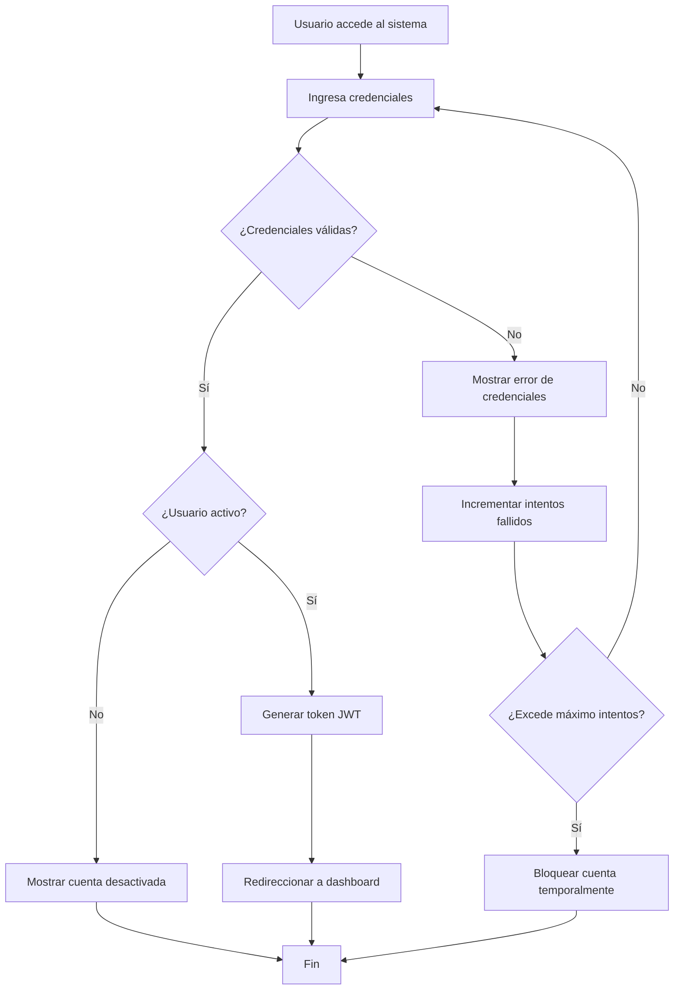
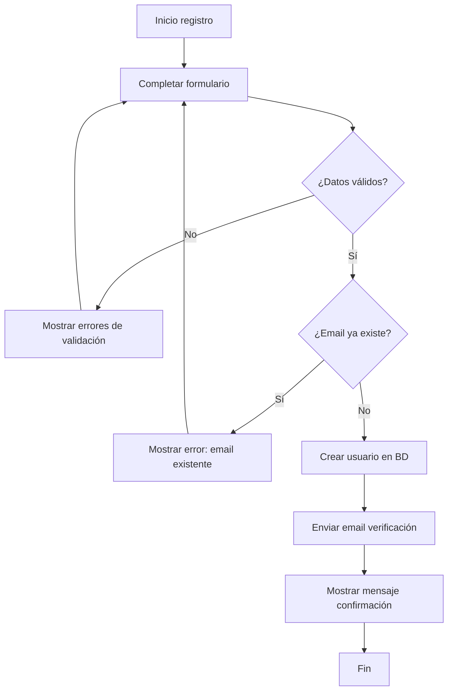
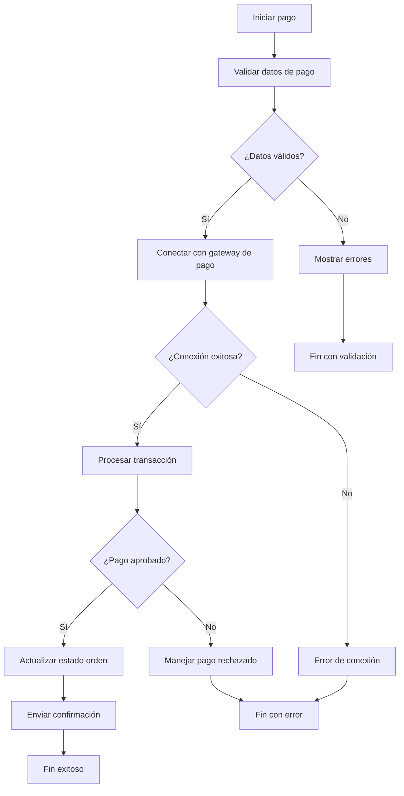

# Diagramas de Flujo

## Conocimientos involucrados
- Análisis de procesos
- Herramientas de diagramación
- Identificación de flujos de trabajo

## Responsable
- Equipo de desarrollo

## ¿Qué es?

Los diagramas de flujo son representaciones gráficas que muestran la secuencia
de pasos, decisiones y procesos dentro de un sistema o aplicación. Utilizan
símbolos estandarizados para representar diferentes tipos de operaciones, como
procesos, decisiones, entradas/salidas, y puntos de inicio y fin.

## ¿Por qué es importante?

Los diagramas de flujo son fundamentales para:

- **Visualización clara**: Permiten entender de manera visual cómo fluye la
  información y los procesos en el sistema
- **Comunicación efectiva**: Facilitan la comunicación entre desarrolladores,
  stakeholders y usuarios finales
- **Identificación de problemas**: Ayudan a detectar cuellos de botella,
  redundancias o procesos innecesarios
- **Documentación técnica**: Sirven como documentación viva del comportamiento
  del sistema
- **Planificación y análisis**: Permiten analizar diferentes escenarios y
  planificar mejoras
- **Debugging y testing**: Facilitan la identificación de casos de prueba y
  puntos críticos

## ¿Qué debe incluir?

Un diagrama de flujo completo debe contener:

- **Punto de inicio y fin claramente definidos**
- **Procesos principales** representados con símbolos apropiados
- **Puntos de decisión** con todas las posibles rutas
- **Entradas y salidas** del sistema o proceso
- **Manejo de errores** y casos excepcionales
- **Validaciones** y controles de calidad
- **Conectores** que muestren el flujo lógico
- **Leyenda** explicando los símbolos utilizados
- **Anotaciones** cuando sea necesario aclarar procesos complejos

## ¿Qué debo hacer?

### 1. Identificar los procesos a diagramar

- Listar todos los procesos críticos del sistema
- Definir el alcance de cada diagrama
- Priorizar por importancia y complejidad

### 2. Definir la simbología estándar

- Utilizar símbolos ISO estándar para diagramas de flujo
- Crear una leyenda consistente para todo el proyecto
- Establecer convenciones de colores y estilos

### 3. Crear los diagramas principales

- **Flujo de autenticación y autorización**
- **Procesos de negocio principales**
- **Flujos de datos críticos**
- **Procesos de error y recuperación**
- **Workflows de usuario**

### 4. Validar y revisar

- Revisar con el equipo técnico
- Validar con stakeholders
- Probar que cubran todos los casos de uso
- Actualizar según feedback recibido

### 5. Documentar y mantener

- Integrar en la documentación técnica
- Versionar cambios
- Mantener actualizado con cambios del sistema

## Tips

- **Usa herramientas apropiadas**: Lucidchart, Draw.io, Miro, o herramientas de
  código como Mermaid
- **Mantén simplicidad**: Evita sobrecargar los diagramas con demasiada
  información
- **Sé consistente**: Usa la misma simbología y estilo en todos los diagramas
- **Incluye casos de error**: No olvides documentar qué pasa cuando algo falla
- **Utiliza colores estratégicamente**: Para destacar procesos críticos o
  diferentes tipos de flujo
- **Agrupa procesos relacionados**: Mantén coherencia visual agrupando procesos
  similares
- **Valida con usuarios reales**: Asegúrate de que los flujos representen la
  realidad
- **Mantén actualizado**: Los diagramas obsoletos son peores que no tener
  diagramas

## Ejemplos

### Ejemplo 1: Flujo de Autenticación de Usuario

### Ejemplo 2: Proceso de Registro de Usuario

### Ejemplo 3: Flujo de Procesamiento de Pagos

### Leyenda de Símbolos

- **Óvalo**: Inicio/Fin del proceso
- **Rectángulo**: Proceso o acción
- **Rombo**: Punto de decisión
- **Paralelogramo**: Entrada/Salida de datos
- **Círculo**: Conector
- **Flecha**: Dirección del flujo

## Navegación

[⬅️ Diseño de APIs](./diseno-apis.md) | [🏠 README Principal](../../README.md) |
[Casos de Uso y User Stories ➡️](./casos-uso-user-stories.md)
