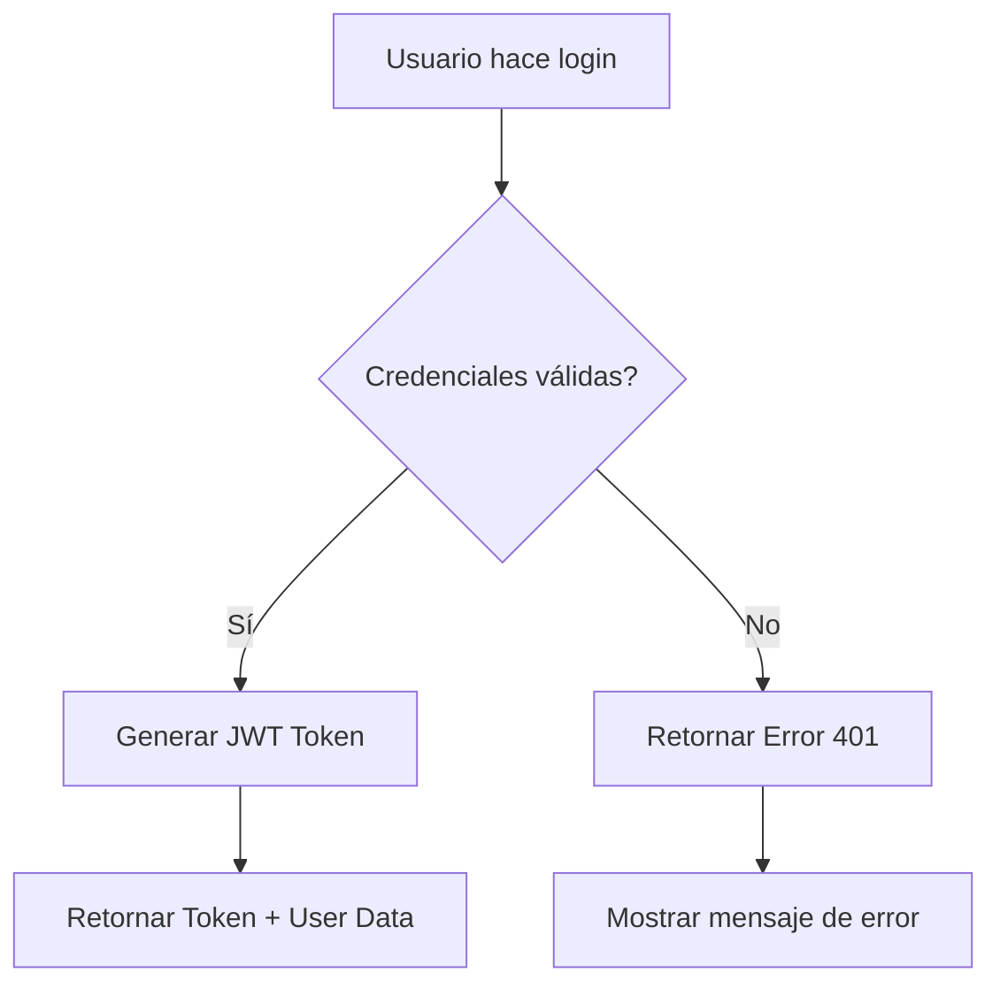

# Estilo y Formato de Documentación

## Conocimientos involucrados
- Normas de documentación
- Herramientas de edición y formateo
- Consistencia visual y estructural

## Responsable
- Equipo de desarrollo

## ¿Qué es?

El **estilo y formato de documentación** define las convenciones visuales,
estructurales y de contenido que garantizan consistencia, legibilidad y
profesionalismo en toda la documentación del proyecto. En el contexto de Clean
Architecture + DDD, esto incluye establecer estándares para documentar
arquitectura, código, APIs, procesos y guías de usuario que reflejen la calidad
y organización del sistema técnico.

Estas convenciones actúan como una **guía de estilo unificada** que asegura que
toda la documentación mantenga un nivel de calidad homogéneo, independientemente
del autor, facilitando la lectura, comprensión y mantenimiento de la información
técnica.

## ¿Por qué es importante?

### 📖 **Legibilidad y Comprensión**

- Facilita la lectura y navegación de documentos largos
- Mejora la comprensión mediante estructura visual clara
- Reduce la carga cognitiva del lector

### 🎯 **Profesionalismo y Credibilidad**

- Proyecta una imagen profesional y organizada
- Inspira confianza en la calidad técnica del proyecto
- Facilita presentaciones a stakeholders y clientes

### 🔄 **Consistencia y Uniformidad**

- Garantiza experiencia uniforme entre documentos
- Facilita contribuciones de múltiples autores
- Reduce tiempo de adaptación para nuevos lectores

### ⚡ **Eficiencia en Mantenimiento**

- Templates reutilizables aceleran la creación de documentos
- Estándares claros reducen revisiones y correcciones
- Automatización posible mediante convenciones establecidas

### 🎨 **Accesibilidad y Usabilidad**

- Mejora accesibilidad para usuarios con diferentes necesidades
- Facilita conversión entre formatos (web, PDF, print)
- Optimiza la experiencia en diferentes dispositivos

## ¿Qué debe incluir?

### Estructura y Layout

- Templates estándar para diferentes tipos de documentos
- Jerarquía de títulos y secciones consistente
- Espaciado y márgenes estandarizados
- Sistema de numeración y organización

### Elementos Visuales

- Paleta de colores para diferentes tipos de contenido
- Iconografía consistente y significativa
- Tipografía y sizing estandarizados
- Uso de elementos gráficos (tablas, diagramas, códigos)

### Convenciones de Contenido

- Tono y estilo de escritura
- Terminología y glosario estándar
- Formato para ejemplos de código
- Estructura para procedimientos y guías

### Elementos Técnicos

- Formato para documentación de APIs
- Convenciones para diagramas técnicos
- Estándares para capturas de pantalla
- Plantillas para especificaciones técnicas

## ¿Qué debo hacer?

### 1. **Definir Guía de Estilo Base**

Establecer convenciones fundamentales:

```markdown
# Guía de Estilo - Checklist Básico

- [ ] Títulos en formato consistente
- [ ] Uso de emojis estandarizado
- [ ] Bloques de código con syntax highlighting
- [ ] Tablas con formato uniforme
- [ ] Enlaces con texto descriptivo
- [ ] Imágenes con alt text y captions
```

### 2. **Crear Templates Reutilizables**

Desarrollar plantillas para diferentes tipos de documentación.

### 3. **Implementar Herramientas de Validación**

Scripts para verificar cumplimiento de estándares automáticamente.

## Convenciones de Formato

## 📝 **Estructura de Documentos**

### Template Base Estándar

```markdown
---
title: "Título Descriptivo del Documento"
description: "Descripción breve de 1-2 líneas"
author: "Nombre del Autor"
created: "YYYY-MM-DD"
updated: "YYYY-MM-DD"
version: "1.0"
status: "approved"
audience: ["developers", "devops"]
type: "guide"
tags: ["backend", "php", "laravel"]
---

# Título Principal del Documento

## 🎯 Objetivo

[Descripción clara del propósito en 2-3 líneas]

## 📋 Prerequisitos

- [ ] Prerequisito 1
- [ ] Prerequisito 2
- [ ] Prerequisito 3

## 🚀 Contenido Principal

### Sección 1: [Nombre Descriptivo]

[Contenido con ejemplos y explicaciones]

### Sección 2: [Siguiente Tema]

[Continuación del contenido]

## ✅ Resumen y Próximos Pasos

- Resumen de lo cubierto
- Enlaces a documentación relacionada
- Siguientes pasos recomendados

## 📚 Referencias

- [Enlace 1](./referencia-1.md)
- [Enlace 2](./referencia-2.md)

---

## Navegación

⬅️ [Documento Anterior](./doc-anterior.md) | 🏠 [Inicio](../../README.md) | ➡️
[Documento Siguiente](./doc-siguiente.md)
```

### Jerarquía de Títulos

```markdown
# H1 - Título Principal del Documento (Solo uno por documento)

## H2 - Secciones Principales 🎯

### H3 - Subsecciones importantes

#### H4 - Detalles específicos

##### H5 - Sub-detalles (usar raramente)

# ✅ Ejemplo correcto:

# Setup de Entorno de Desarrollo

## 🎯 Objetivo

## 📋 Prerequisitos

## ⚡ Pasos de Instalación

### Paso 1: Configurar Docker

#### Verificar Instalación

### Paso 2: Configurar Base de Datos

## ✅ Verificación Final

# ❌ Ejemplo incorrecto (múltiples H1):

# Setup de Entorno

# Configuración de Docker ← Debería ser H2

# Base de Datos ← Debería ser H2
```

## 🎨 **Elementos Visuales**

### Sistema de Iconos Estándar

```markdown
## Iconos por Tipo de Contenido

### 📋 Información General

🎯 Objetivo / Propósito 📋 Prerequisitos / Checklist 📚 Referencias /
Documentación 📊 Métricas / Estadísticas 📝 Notas / Observaciones

### ⚡ Acciones y Procesos

⚡ Pasos de Ejecución 🚀 Getting Started / Quick Start 🔧 Configuración / Setup
⚙️ Operaciones / Mantenimiento 🔄 Procesos / Workflows

### ✅ Resultados y Estados

✅ Éxito / Completado ❌ Error / Fallo ⚠️ Advertencia / Atención 💡 Tips /
Mejores Prácticas 🔍 Investigación / Análisis

### 👥 Roles y Audiencias

👩‍💻 Desarrolladores 🚀 DevOps / SRE 📊 Product / Business 👥 End Users 🏛️
Management / Stakeholders

### 🏗️ Arquitectura y Tecnología

🏗️ Arquitectura / Diseño 🔌 APIs / Integración 🗄️ Base de Datos 🐳 Docker /
Contenedores ☁️ Cloud / Infraestructura
```

### Uso de Colores en Markdown

````markdown
## Destacados con Colores (GitHub/GitLab compatible)

### Para Alertas

> **⚠️ ADVERTENCIA**: Información importante que requiere atención

> **💡 TIP**: Consejo útil para mejorar la implementación

> **❌ ERROR**: Problema común y su solución

### Para Código de Estado

```diff
+ Código agregado o correcto
- Código eliminado o incorrecto
! Código que requiere atención
```
````

### Para Badges


````
## 💻 **Formato de Código**

### Bloques de Código
```markdown
## Convenciones para Código

### Código Inline
Usar `backticks` para comandos cortos, variables y nombres de archivos.
Ejemplo: Ejecutar `php artisan migrate` en el directorio `backend/`.

### Bloques de Código con Lenguaje
```php
<?php
// ✅ Siempre especificar el lenguaje para syntax highlighting
class UserService
{
    public function createUser(UserDTO $userData): User
    {
        // Implementación
    }
}
````

```bash
# ✅ Para comandos de terminal
docker-compose up -d
php artisan migrate
npm run build
```

```yaml
# ✅ Para archivos de configuración
version: "3.8"
services:
   app:
      image: php:8.2-fpm
      volumes:
         - .:/var/www
```

### Código con Comentarios Explicativos

```typescript
// ✅ Comentarios que explican el contexto
interface UserProps {
   id: string; // UUID generado por el backend
   email: string; // Debe ser único en el sistema
   name: string; // Nombre completo del usuario
   roles: Role[]; // Array de roles asignados
}

// ✅ Función con documentación JSDoc
/**
 * Crea un nuevo usuario en el sistema
 * @param userData - Datos del usuario a crear
 * @returns Promise con el usuario creado
 * @throws UserAlreadyExistsError si el email ya está registrado
 */
async function createUser(userData: CreateUserRequest): Promise<User> {
   // Implementación...
}
```

### Outputs y Resultados

````markdown
### Mostrar Outputs Esperados

```bash
$ docker-compose ps
NAME                COMMAND             SERVICE     STATUS
backend-app-1       "php-fpm"           app         running
backend-db-1        "mysqld"            db          running
backend-redis-1     "redis-server"      redis       running
```
````

**Resultado esperado**: Todos los servicios en estado "running"

````
## 📊 **Tablas y Datos Estructurados**

### Formato de Tablas
```markdown
## Tablas Bien Formateadas

### Información Técnica
| Componente | Versión | Puerto | Estado | Notas |
|------------|---------|---------|---------|-------|
| PHP        | 8.2     | -       | ✅ OK   | Con extensiones requeridas |
| MySQL      | 8.0     | 3306    | ✅ OK   | Configurado para UTF8MB4 |
| Redis      | 7.0     | 6379    | ✅ OK   | Para cache y sesiones |
| Nginx      | 1.21    | 80/443  | ✅ OK   | Proxy reverso configurado |

### API Endpoints
| Método | Endpoint | Descripción | Autenticación |
|--------|----------|-------------|---------------|
| POST   | `/api/v1/users` | Crear usuario | Bearer Token |
| GET    | `/api/v1/users/{id}` | Obtener usuario | Bearer Token |
| PUT    | `/api/v1/users/{id}` | Actualizar usuario | Bearer Token |
| DELETE | `/api/v1/users/{id}` | Eliminar usuario | Bearer Token |

### Checklist de Validación
| Elemento | Estado | Responsable | Fecha Límite |
|----------|---------|-------------|--------------|
| Setup Docker | ✅ Completado | Dev Team | 2023-12-01 |
| Tests Backend | 🔄 En Progreso | QA Team | 2023-12-05 |
| Deploy Staging | ⏳ Pendiente | DevOps | 2023-12-08 |
| Review Seguridad | ❌ No Iniciado | Security | 2023-12-10 |
````

## 🖼️ **Imágenes y Diagramas**

### Convenciones para Imágenes

````markdown
## Formato de Imágenes

### Capturas de Pantalla

 _Figura 1:
Página de login con validación de errores_

### Diagramas de Arquitectura

 _Diagrama
1: Arquitectura general del sistema mostrando las capas de Clean Architecture_

### Diagramas de Flujo con Mermaid


````

_Flujo 1: Proceso de autenticación de usuarios_

### Convenciones de Naming

- `screenshot-[componente]-[accion].png`
- `diagram-[tipo]-[descripcion].svg`
- `flowchart-[proceso].png`
- `architecture-[layer]-overview.svg`

````
## 📋 **Listas y Elementos Estructurados**

### Tipos de Listas
```markdown
## Convenciones para Listas

### Listas de Verificación (Checklists)
- [ ] Elemento no completado
- [x] Elemento completado
- [ ] Elemento pendiente

### Listas Ordenadas (Procedimientos)
1. **Primer paso**: Descripción detallada del primer paso
2. **Segundo paso**: Continúa con el siguiente paso lógico
3. **Tercer paso**: Finaliza con el último paso

### Listas con Prioridades
#### 🔴 Alta Prioridad
- Configurar autenticación de seguridad
- Implementar backup de base de datos
- Setup de monitoreo básico

#### 🟡 Media Prioridad  
- Optimizar performance de queries
- Implementar cache de aplicación
- Documentar APIs adicionales

#### 🟢 Baja Prioridad
- Mejorar UI/UX del dashboard
- Implementar features adicionales
- Optimización de SEO

### Listas con Categorización
#### Backend (PHP/Laravel)
- [ ] Setup Clean Architecture
- [ ] Implementar Domain Layer
- [ ] Configurar Testing Suite

#### Frontend (React/TypeScript)
- [ ] Configurar Vite + TypeScript
- [ ] Implementar componentes base
- [ ] Setup Redux Toolkit

#### DevOps (Docker/CI-CD)
- [ ] Configurar Docker Compose
- [ ] Setup GitHub Actions
- [ ] Configurar ambientes
````

## 🔗 **Enlaces y Referencias**

### Formato de Enlaces

```markdown
## Convenciones para Enlaces

### Enlaces Internos (Documentación)

- [Texto descriptivo del enlace](./ruta/al/documento.md)
- [Setup de Entorno Local](../development/setup/local-environment.md)
- [API de Usuarios](../api/v1/users.md)

### Enlaces Externos

- [Laravel Documentation](https://laravel.com/docs) - Documentación oficial
- [React TypeScript Cheatsheet](https://react-typescript-cheatsheet.js.org/) -
  Guía de referencia
- [Clean Architecture Book](https://blog.cleancoder.com/uncle-bob/2012/08/13/the-clean-architecture.html) -
  Artículo original

### Enlaces con Contexto

Ver la [guía de configuración de Docker](./docker-setup.md) para más detalles
sobre la configuración de contenedores.

Para información específica sobre autenticación, consulta la
[documentación de Laravel Sanctum](../api/authentication.md#sanctum-setup).

### Referencias a Código

Revisar la implementación en
[`UserController`](../backend/app/Infrastructure/Http/Controllers/Api/V1/UserController.php)
para ver ejemplos prácticos.

El archivo de configuración principal se encuentra en
[`docker-compose.yml`](../docker-compose.yml).
```

## 🛠️ **Templates Especializados**

### Template para Documentación de APIs

````markdown
# API [Nombre del Recurso] v[Versión]

## 🎯 Overview

Descripción breve de la funcionalidad de esta API.

## 🔐 Autenticación

```bash
Authorization: Bearer {jwt_token}
Content-Type: application/json
```
````

## 📡 Endpoints

### POST /api/v1/[resource]

**Descripción**: Crear nuevo [recurso]

**Request Body**:

```json
{
   "field1": "string",
   "field2": "integer",
   "field3": "boolean"
}
```

**Response Success (201)**:

```json
{
   "data": {
      "id": "uuid",
      "field1": "string",
      "field2": 123,
      "created_at": "2023-12-01T10:00:00Z"
   },
   "message": "Resource created successfully"
}
```

**Response Error (400)**:

```json
{
   "error": {
      "code": "VALIDATION_ERROR",
      "message": "The given data was invalid",
      "details": {
         "field1": ["The field1 field is required"]
      }
   }
}
```

### GET /api/v1/[resource]/{id}

[Continuar con otros endpoints...]

## 🧪 Ejemplos de Uso

### cURL

```bash
# Crear recurso
curl -X POST https://api.example.com/api/v1/users \
  -H "Authorization: Bearer eyJ0eXAiOiJKV1Q..." \
  -H "Content-Type: application/json" \
  -d '{"name": "John Doe", "email": "john@example.com"}'
```

### JavaScript/TypeScript

```typescript
const response = await fetch("/api/v1/users", {
   method: "POST",
   headers: {
      "Authorization": `Bearer ${token}`,
      "Content-Type": "application/json",
   },
   body: JSON.stringify({
      name: "John Doe",
      email: "john@example.com",
   }),
});
```

## 📊 Rate Limiting

| Endpoint            | Límite       | Ventana  |
| ------------------- | ------------ | -------- |
| POST /api/v1/users  | 10 requests  | 1 minuto |
| GET /api/v1/users/* | 100 requests | 1 minuto |

````
### Template para Procedimientos
```markdown
# Procedimiento: [Nombre del Proceso]

## 🎯 Objetivo
[Descripción clara de qué logra este procedimiento]

## 👥 Roles Involucrados
- **Ejecutor**: [Quien ejecuta el procedimiento]
- **Supervisor**: [Quien supervisa/aprueba]
- **Notificados**: [Quienes deben ser informados]

## ⏰ Duración Estimada
- **Preparación**: [X minutos]
- **Ejecución**: [X minutos]  
- **Verificación**: [X minutos]
- **Total**: [X minutos]

## 📋 Prerequisitos
- [ ] [Prerequisito 1 con criterios específicos]
- [ ] [Prerequisito 2 con criterios específicos]
- [ ] [Accesos/permisos necesarios]

## ⚡ Pasos de Ejecución

### Fase 1: Preparación
#### Paso 1.1: [Acción específica]
```bash
# Comando exacto a ejecutar
comando --parametro valor
````

**Resultado esperado**: [Descripción específica] **Validación**: [Cómo verificar
que funcionó] **Tiempo estimado**: [X minutos]

#### Paso 1.2: [Siguiente acción]

[Continuar con pasos detallados...]

### Fase 2: Ejecución Principal

[Continuar con fases...]

### Fase 3: Verificación

[Pasos de verificación...]

## ✅ Criterios de Éxito

- [ ] [Criterio medible 1]
- [ ] [Criterio medible 2]
- [ ] [Criterio medible 3]

## 🚨 Manejo de Errores

### Error Común 1: [Descripción]

**Síntomas**: [Cómo se manifiesta] **Causas**: [Posibles causas] **Solución**:

```bash
# Comandos específicos para resolver
```

### Error Común 2: [Descripción]

[Continuar con otros errores...]

## 🔄 Rollback (Si aplica)

### Condiciones para Rollback

- [Condición 1]
- [Condición 2]

### Procedimiento de Rollback

```bash
# Comandos específicos para revertir cambios
```

## 📞 Contactos y Escalamiento

- **Nivel 1**: [Contacto inmediato]
- **Nivel 2**: [Escalamiento técnico]
- **Nivel 3**: [Escalamiento gerencial]

## 📚 Referencias

- [Documento relacionado 1](./doc1.md)
- [Runbook relacionado](./runbook.md)

````
## 🔍 **Validación y Herramientas**

### Script de Validación de Formato
```bash
#!/bin/bash
# scripts/validate-doc-format.sh

echo "🔍 Validando formato de documentación..."

DOCS_DIR="docs"
ERRORS=0
WARNINGS=0

# Función para verificar formato de documento
check_document_format() {
    local file=$1
    echo "📄 Validando: $(basename "$file")"
    
    # Verificar metadatos YAML
    if ! head -n 10 "$file" | grep -q "^---"; then
        echo "⚠️  Falta metadata YAML en $file"
        WARNINGS=$((WARNINGS + 1))
    fi
    
    # Verificar título principal (solo un H1)
    h1_count=$(grep -c "^# " "$file")
    if [ "$h1_count" -ne 1 ]; then
        echo "❌ Debe haber exactamente un H1 en $file (encontrado: $h1_count)"
        ERRORS=$((ERRORS + 1))
    fi
    
    # Verificar que bloques de código tengan lenguaje especificado
    if grep -n '```$' "$file"; then
        echo "⚠️  Bloques de código sin lenguaje especificado en $file"
        WARNINGS=$((WARNINGS + 1))
    fi
    
    # Verificar estructura de navegación
    if ! grep -q "## Navegación" "$file" && ! grep -q "⬅️.*🏠.*➡️" "$file"; then
        echo "⚠️  Falta navegación estándar en $file"
        WARNINGS=$((WARNINGS + 1))
    fi
    
    # Verificar enlaces relativos
    while IFS= read -r line; do
        if [[ $line =~ \[.*\]\((.*\.md.*)\) ]]; then
            link_path="${BASH_REMATCH[1]}"
            # Resolver path relativo
            dir=$(dirname "$file")
            full_path="$dir/$link_path"
            if [[ ! "$link_path" =~ ^https?:// ]] && [ ! -f "$full_path" ]; then
                echo "❌ Enlace roto en $file: $link_path"
                ERRORS=$((ERRORS + 1))
            fi
        fi
    done < "$file"
}

# Verificar todos los archivos markdown
find "$DOCS_DIR" -name "*.md" -type f | while read -r file; do
    check_document_format "$file"
done

# Resumen final
echo ""
echo "📊 RESUMEN DE VALIDACIÓN:"
echo "   Errores: $ERRORS"
echo "   Advertencias: $WARNINGS"

if [ $ERRORS -eq 0 ] && [ $WARNINGS -eq 0 ]; then
    echo "🎉 Todos los documentos cumplen con el formato estándar"
    exit 0
elif [ $ERRORS -eq 0 ]; then
    echo "👍 Formato aceptable con advertencias menores"
    exit 0
else
    echo "❌ Se encontraron errores de formato que deben corregirse"
    exit 1
fi
````

### Linter de Markdown

```json
{
   "markdownlint": {
      "MD013": false,
      "MD033": {
         "allowed_elements": ["details", "summary", "br"]
      },
      "MD041": false,
      "MD040": true
   }
}
```

## Tips

### 💡 **Mejores Prácticas**

1. **Consistencia Visual**
   - Usa siempre el mismo sistema de iconos
   - Mantén jerarquía de títulos clara
   - Aplica formato uniforme en todos los documentos

2. **Legibilidad**
   - Líneas no muy largas (max 80-100 caracteres)
   - Espaciado adecuado entre secciones
   - Uso efectivo de elementos visuales

3. **Navegación**
   - Enlaces descriptivos, no genéricos ("click aquí")
   - Breadcrumbs en documentos complejos
   - Tabla de contenidos para documentos largos

4. **Mantenimiento**
   - Templates para acelerar creación
   - Herramientas de validación automática
   - Revisiones periódicas de formato

### ⚠️ **Errores Comunes a Evitar**

- Múltiples H1 en un documento
- Código sin syntax highlighting especificado
- Enlaces rotos o genéricos
- Imágenes sin alt text
- Tablas mal formateadas
- Falta de navegación entre documentos

## Ejemplos

### Documento con Formato Perfecto

````markdown
---
title: "Setup de Entorno de Desarrollo Local"
description: "Guía completa para configurar entorno local con Docker"
author: "Dev Team"
created: "2023-12-01"
updated: "2023-12-01"
version: "1.0"
status: "approved"
audience: ["developers"]
type: "guide"
tags: ["setup", "docker", "development"]
---

# Setup de Entorno de Desarrollo Local

## 🎯 Objetivo

Configurar un entorno de desarrollo completamente funcional usando Docker para
facilitar el desarrollo colaborativo y consistente entre todos los miembros del
equipo.

## 📋 Prerequisitos

- [ ] Docker Desktop instalado y funcionando
- [ ] Git configurado con SSH keys del proyecto
- [ ] Node.js 18+ instalado para herramientas de desarrollo
- [ ] Editor con extensiones recomendadas (VS Code + extensiones)

## ⚡ Configuración Paso a Paso

### Paso 1: Clonar y Configurar Repositorio

```bash
# Clonar el repositorio principal
git clone git@github.com:organization/project.git
cd project

# Configurar variables de entorno
cp .env.example .env
```
````

**Resultado esperado**: Código descargado y archivo `.env` creado
**Validación**: `ls -la` muestra archivos del proyecto y `.env`

### Paso 2: Levantar Servicios con Docker

```bash
# Construir y levantar todos los servicios
docker-compose up -d --build

# Verificar que todos los servicios estén ejecutándose
docker-compose ps
```

**Resultado esperado**: Todos los servicios en estado "Up"

| Servicio | Puerto | Estado Esperado |
| -------- | ------ | --------------- |
| app      | 8000   | ✅ Up           |
| frontend | 3000   | ✅ Up           |
| db       | 3306   | ✅ Up           |
| redis    | 6379   | ✅ Up           |

## ✅ Verificación Final

- [ ] Backend responde en `http://localhost:8000/api/health`
- [ ] Frontend carga en `http://localhost:3000`
- [ ] Base de datos contiene tablas con datos de prueba
- [ ] Tests básicos pasan: `composer test` y `npm run test`

## 🚨 Troubleshooting Común

### Error: "Port 3000 already in use"

**Síntoma**: Docker Compose falla al iniciar frontend **Solución**:

```bash
# Verificar proceso que usa el puerto
lsof -ti:3000 | xargs kill -9

# O cambiar puerto en docker-compose.yml
sed -i 's/3000:3000/3001:3000/' docker-compose.yml
```

## 📚 Referencias

- [Configuración de Docker Compose](./docker-compose-guide.md)
- [Guía de Variables de Entorno](./environment-variables.md)
- [Troubleshooting Docker](../operations/troubleshooting/docker-issues.md)

## Navegación

[⬅️ Checklist Mínima por Proyecto](./checklist-minima-proyecto.md) |
[🏠 README Principal](../../README.md) |
[Generación de Diagramas ➡️](./generacion-diagramas.md)
````
