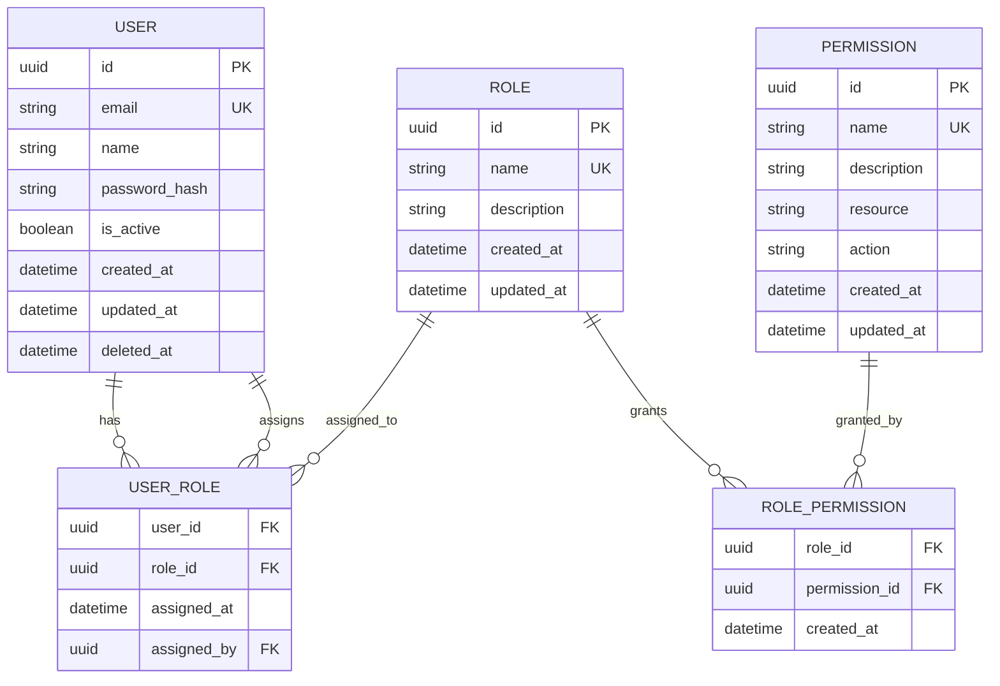
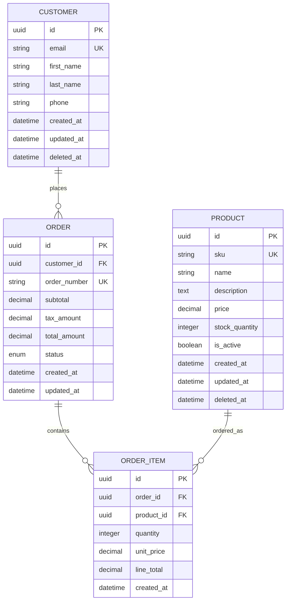
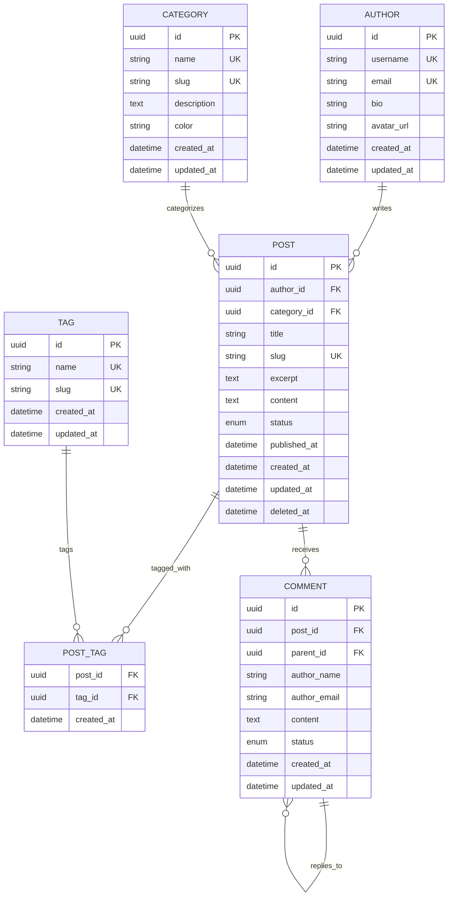

# Modelado de Datos

## ¿Qué es?

El modelado de datos es el proceso sistemático de crear una representación
abstracta y conceptual de los datos que una aplicación necesita almacenar,
procesar y gestionar. Es la fase inicial del diseño de base de datos que se
enfoca en identificar, definir y organizar las entidades del dominio del
negocio, sus atributos y las relaciones entre ellas.

En el contexto de Clean Architecture y DDD, el modelado de datos debe reflejar
fielmente el dominio del negocio, manteniendo la independencia del framework y
la base de datos específica.

## ¿Por qué es importante?

- **Comprensión del dominio**: Facilita el entendimiento profundo del negocio y
  sus reglas
- **Comunicación efectiva**: Proporciona un lenguaje común entre stakeholders
  técnicos y de negocio
- **Detección temprana de problemas**: Identifica inconsistencias y ambigüedades
  antes del desarrollo
- **Base para el diseño**: Establece los fundamentos para el diseño físico de la
  base de datos
- **Validación de requerimientos**: Confirma que todos los requisitos de datos
  están cubiertos
- **Escalabilidad futura**: Facilita la evolución y mantenimiento del sistema
- **Calidad de datos**: Asegura la integridad y consistencia desde el diseño

## ¿Qué debe incluir?

### Análisis del Dominio

#### Identificación de Entidades

- **Entidades principales**: Objetos del mundo real con identidad propia
- **Entidades débiles**: Objetos que dependen de otras entidades para existir
- **Entidades asociativas**: Representan relaciones muchos a muchos
- **Entidades de control**: Gestionan procesos y flujos de trabajo

#### Definición de Atributos

- **Atributos simples**: Valores atómicos no divisibles
- **Atributos compuestos**: Formados por múltiples componentes
- **Atributos multivaluados**: Pueden tener múltiples valores
- **Atributos derivados**: Calculados a partir de otros atributos

### Análisis de Relaciones

#### Tipos de Relaciones

- **Uno a Uno (1:1)**: Cada instancia se relaciona con máximo una instancia
- **Uno a Muchos (1:N)**: Una instancia se relaciona con múltiples instancias
- **Muchos a Muchos (N:M)**: Múltiples instancias se relacionan entre sí

#### Cardinalidad y Participación

- **Cardinalidad mínima y máxima**: Límites de la relación
- **Participación total**: Todas las instancias deben participar
- **Participación parcial**: Algunas instancias pueden no participar

## ¿Qué debo hacer?

### 1. Análisis de Requerimientos de Datos

#### Extracción de Entidades desde User Stories

```markdown
# User Story: Gestión de Usuarios

Como administrador del sistema Quiero gestionar usuarios y sus roles Para
controlar el acceso a la aplicación

## Análisis de Entidades:

- **Usuario**: email, nombre, password, fecha_registro, estado
- **Rol**: nombre, descripción, permisos
- **Permiso**: nombre, descripción, recurso, acción
- **Sesión**: token, fecha_inicio, fecha_expiracion, ip_address

## Relaciones Identificadas:

- Usuario -> Rol (N:M): Un usuario puede tener múltiples roles
- Rol -> Permiso (N:M): Un rol puede tener múltiples permisos
- Usuario -> Sesión (1:N): Un usuario puede tener múltiples sesiones activas
```

#### Workshop de Domain Modeling

```php
<?php
// tools/domain-modeling-workshop.php

/**
 * Script para facilitar workshops de modelado de dominio
 */
class DomainModelingWorkshop
{
    private array $entities = [];
    private array $relationships = [];
    private array $businessRules = [];

    public function startSession(string $domain): void
    {
        echo "🎯 Domain Modeling Workshop: {$domain}\n";
        echo "================================\n\n";
        
        $this->identifyEntities();
        $this->defineAttributes();
        $this->establishRelationships();
        $this->validateBusinessRules();
        $this->generateOutput();
    }

    private function identifyEntities(): void
    {
        echo "📋 Step 1: Entity Identification\n";
        echo "Identify nouns from business requirements:\n\n";
        
        // Plantilla para identificación de entidades
        $template = [
            'core_entities' => [
                'description' => 'Main business objects with independent lifecycle',
                'examples' => ['User', 'Product', 'Order', 'Customer']
            ],
            'value_objects' => [
                'description' => 'Objects defined by their attributes, immutable',
                'examples' => ['Email', 'Money', 'Address', 'Phone']
            ],
            'aggregates' => [
                'description' => 'Clusters of entities treated as single unit',
                'examples' => ['Order + OrderItems', 'User + UserProfile']
            ]
        ];

        foreach ($template as $type => $info) {
            echo "  {$type}: {$info['description']}\n";
            echo "  Examples: " . implode(', ', $info['examples']) . "\n\n";
        }
    }

    private function defineAttributes(): void
    {
        echo "🏷️  Step 2: Attribute Definition\n";
        echo "For each entity, define:\n\n";
        
        $attributeTypes = [
            'identifier' => 'Unique identifier (UUID, ID)',
            'required' => 'Mandatory business attributes',
            'optional' => 'Optional attributes',
            'computed' => 'Derived or calculated attributes',
            'audit' => 'Tracking attributes (created_at, updated_at)'
        ];

        foreach ($attributeTypes as $type => $description) {
            echo "  - {$type}: {$description}\n";
        }
        echo "\n";
    }

    private function establishRelationships(): void
    {
        echo "🔗 Step 3: Relationship Establishment\n";
        echo "Define how entities connect:\n\n";
        
        $relationships = [
            'association' => 'Simple relationship between entities',
            'aggregation' => 'Whole-part relationship (weak ownership)',
            'composition' => 'Strong ownership relationship',
            'inheritance' => 'Is-a relationship between entities'
        ];

        foreach ($relationships as $type => $description) {
            echo "  - {$type}: {$description}\n";
        }
        echo "\n";
    }

    private function validateBusinessRules(): void
    {
        echo "✅ Step 4: Business Rules Validation\n";
        echo "Ensure model supports all business rules:\n\n";
        
        $ruleCategories = [
            'constraints' => 'Data validation rules',
            'invariants' => 'Rules that must always be true',
            'policies' => 'Business logic and workflows',
            'calculations' => 'Derived data and formulas'
        ];

        foreach ($ruleCategories as $category => $description) {
            echo "  - {$category}: {$description}\n";
        }
        echo "\n";
    }

    private function generateOutput(): void
    {
        echo "📄 Step 5: Documentation Generation\n";
        echo "Create comprehensive documentation:\n\n";
        
        echo "  - Entity-Relationship Diagram (ERD)\n";
        echo "  - Data Dictionary\n";
        echo "  - Business Rules Documentation\n";
        echo "  - Domain Model Code\n";
        echo "  - Validation Scenarios\n\n";
    }
}

// Ejecutar workshop
$workshop = new DomainModelingWorkshop();
$workshop->startSession("E-commerce Platform");
```

### 2. Creación del Modelo Conceptual

#### Diagrama Entidad-Relación Conceptual



#### Template de Documentación de Entidades

```markdown
# Entity Documentation Template

## Entity: [ENTITY_NAME]

### Business Description

Brief description of what this entity represents in the business domain.

### Attributes

| Attribute  | Type        | Required | Description        | Business Rules              |
| ---------- | ----------- | -------- | ------------------ | --------------------------- |
| id         | UUID        | Yes      | Unique identifier  | Generated automatically     |
| name       | String(100) | Yes      | Entity name        | Must be unique, 2-100 chars |
| created_at | DateTime    | Yes      | Creation timestamp | Auto-generated              |

### Relationships

| Relationship | Target Entity | Cardinality | Description                  |
| ------------ | ------------- | ----------- | ---------------------------- |
| belongs_to   | Parent        | N:1         | Child belongs to parent      |
| has_many     | Children      | 1:N         | Parent has multiple children |

### Business Rules

1. **Rule Name**: Description of the business rule
   - **Validation**: How to validate this rule
   - **Example**: Concrete example

### Invariants

- List of conditions that must always be true for this entity
- These should be enforced at the domain level

### Use Cases

- Primary use cases where this entity is involved
- CRUD operations allowed
- Special business operations
```

### 3. Validación del Modelo con Stakeholders

#### Checklist de Validación

```php
<?php
// tools/model-validation-checklist.php

class ModelValidationChecklist
{
    private array $validationResults = [];

    public function validateModel(array $entities, array $relationships): array
    {
        $this->validateEntities($entities);
        $this->validateRelationships($relationships);
        $this->validateBusinessRules();
        $this->validateNormalization();
        
        return $this->validationResults;
    }

    private function validateEntities(array $entities): void
    {
        foreach ($entities as $entity) {
            // Validar nomenclatura
            $this->checkNaming($entity);
            
            // Validar atributos obligatorios
            $this->checkRequiredAttributes($entity);
            
            // Validar tipos de datos
            $this->checkDataTypes($entity);
            
            // Validar reglas de negocio
            $this->checkBusinessRules($entity);
        }
    }

    private function checkNaming(array $entity): void
    {
        $issues = [];
        
        // Verificar convenciones de nomenclatura
        if (!$this->isPascalCase($entity['name'])) {
            $issues[] = "Entity name should be PascalCase";
        }
        
        if ($this->isPlural($entity['name'])) {
            $issues[] = "Entity name should be singular";
        }
        
        foreach ($entity['attributes'] as $attr) {
            if (!$this->isSnakeCase($attr['name'])) {
                $issues[] = "Attribute '{$attr['name']}' should be snake_case";
            }
        }
        
        if (!empty($issues)) {
            $this->validationResults[$entity['name']]['naming'] = $issues;
        }
    }

    private function checkRequiredAttributes(array $entity): void
    {
        $requiredAttributes = ['id', 'created_at', 'updated_at'];
        $entityAttributes = array_column($entity['attributes'], 'name');
        
        $missing = array_diff($requiredAttributes, $entityAttributes);
        
        if (!empty($missing)) {
            $this->validationResults[$entity['name']]['missing_attributes'] = $missing;
        }
    }

    private function validateBusinessRules(): void
    {
        // Validar que las reglas de negocio estén representadas
        $businessRuleChecks = [
            'data_integrity' => 'Are all data integrity rules enforced?',
            'business_constraints' => 'Are business constraints modeled?',
            'workflow_support' => 'Does model support required workflows?',
            'audit_requirements' => 'Are audit requirements satisfied?'
        ];

        foreach ($businessRuleChecks as $check => $question) {
            echo "❓ {$question}\n";
            // Aquí implementarías la lógica específica de validación
        }
    }

    private function isPascalCase(string $text): bool
    {
        return preg_match('/^[A-Z][a-zA-Z0-9]*$/', $text);
    }

    private function isSnakeCase(string $text): bool
    {
        return preg_match('/^[a-z][a-z0-9_]*$/', $text);
    }

    private function isPlural(string $text): bool
    {
        // Implementación simple - en producción usar librerías especializadas
        return substr($text, -1) === 's';
    }
}
```

### 4. Documentación del Diccionario de Datos

#### Generador Automático de Diccionario

```php
<?php
// tools/data-dictionary-generator.php

class DataDictionaryGenerator
{
    public function generateFromModel(array $model): string
    {
        $output = "# Data Dictionary\n\n";
        $output .= "Generated on: " . date('Y-m-d H:i:s') . "\n\n";
        
        foreach ($model['entities'] as $entity) {
            $output .= $this->generateEntitySection($entity);
        }
        
        $output .= $this->generateRelationshipsSummary($model['relationships']);
        
        return $output;
    }

    private function generateEntitySection(array $entity): string
    {
        $section = "## Entity: {$entity['name']}\n\n";
        $section .= "**Business Description**: {$entity['description']}\n\n";
        
        $section .= "| Attribute | Type | Nullable | Default | Description | Business Rules |\n";
        $section .= "|-----------|------|----------|---------|-------------|----------------|\n";
        
        foreach ($entity['attributes'] as $attr) {
            $section .= sprintf(
                "| %s | %s | %s | %s | %s | %s |\n",
                $attr['name'],
                $attr['type'],
                $attr['nullable'] ? 'Yes' : 'No',
                $attr['default'] ?? 'None',
                $attr['description'],
                $attr['business_rules'] ?? 'None'
            );
        }
        
        $section .= "\n";
        
        if (!empty($entity['indexes'])) {
            $section .= "### Indexes\n\n";
            foreach ($entity['indexes'] as $index) {
                $section .= "- **{$index['name']}**: {$index['type']} on ({$index['columns']})\n";
            }
            $section .= "\n";
        }
        
        return $section;
    }

    private function generateRelationshipsSummary(array $relationships): string
    {
        $section = "## Relationships Summary\n\n";
        $section .= "| From Entity | To Entity | Type | Description |\n";
        $section .= "|-------------|-----------|------|-------------|\n";
        
        foreach ($relationships as $rel) {
            $section .= sprintf(
                "| %s | %s | %s | %s |\n",
                $rel['from_entity'],
                $rel['to_entity'],
                $rel['type'],
                $rel['description']
            );
        }
        
        return $section;
    }
}

// Ejemplo de uso
$model = [
    'entities' => [
        [
            'name' => 'User',
            'description' => 'System user entity',
            'attributes' => [
                [
                    'name' => 'id',
                    'type' => 'UUID',
                    'nullable' => false,
                    'description' => 'Unique identifier',
                    'business_rules' => 'Auto-generated'
                ],
                [
                    'name' => 'email',
                    'type' => 'VARCHAR(255)',
                    'nullable' => false,
                    'description' => 'User email address',
                    'business_rules' => 'Must be unique, valid email format'
                ]
            ],
            'indexes' => [
                [
                    'name' => 'idx_users_email',
                    'type' => 'UNIQUE',
                    'columns' => 'email'
                ]
            ]
        ]
    ],
    'relationships' => [
        [
            'from_entity' => 'User',
            'to_entity' => 'Role',
            'type' => 'N:M',
            'description' => 'Users can have multiple roles'
        ]
    ]
];

$generator = new DataDictionaryGenerator();
echo $generator->generateFromModel($model);
```

## Tips

### Mejores Prácticas

- **Empezar simple**: Comenzar con entidades básicas y refinar iterativamente
- **Involucrar stakeholders**: Validar constantemente con expertos del dominio
- **Documentar decisiones**: Registrar el porqué de cada decisión de modelado
- **Usar nomenclatura consistente**: Establecer y seguir convenciones de nombres
- **Validar con casos de uso**: Asegurar que el modelo soporte todos los
  escenarios
- **Considerar evolución**: Diseñar pensando en futuras extensiones
- **Separar dominio de persistencia**: El modelo conceptual debe ser
  independiente de la tecnología

### Herramientas Recomendadas

- **Lucidchart/Draw.io**: Para diagramas ER visuales
- **Mermaid**: Para diagramas en markdown
- **PlantUML**: Para diagramas programáticos
- **MySQL Workbench**: Para modelado específico de MySQL
- **Figma/Whimsical**: Para workshops colaborativos

### Errores Comunes a Evitar

- **Sobremodelado**: Crear entidades innecesariamente complejas
- **Submodelado**: No capturar suficiente detalle del dominio
- **Mezclar niveles**: Confundir modelo conceptual con físico
- **Ignorar normalizacion**: No aplicar formas normales apropiadas
- **Falta de validación**: No verificar con stakeholders del negocio
- **Nomenclatura inconsistente**: Usar diferentes convenciones en el mismo
  modelo

## Ejemplos

### Modelo E-commerce Básico



### Modelo de Contenido Blog



## Navegación

[⬅️ Estructura de carpetas base](./estructura-carpetas.md) |
[🏠 README Principal](../../README.md) |
[Diseño de Base de Datos ➡️](./diseno-base-datos.md)
